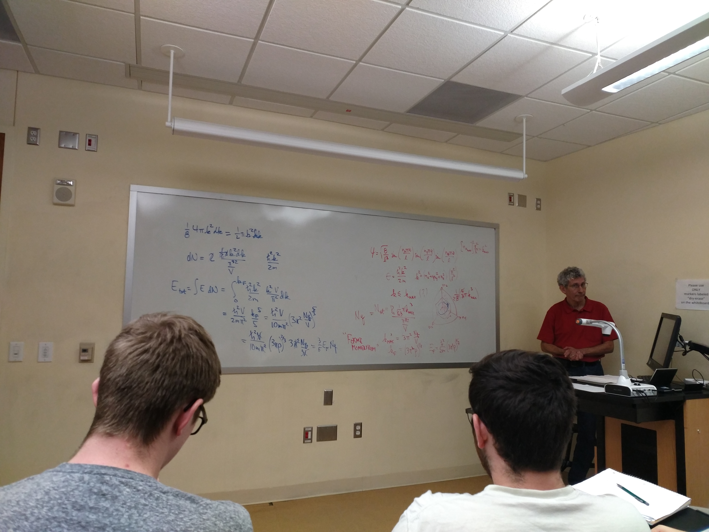
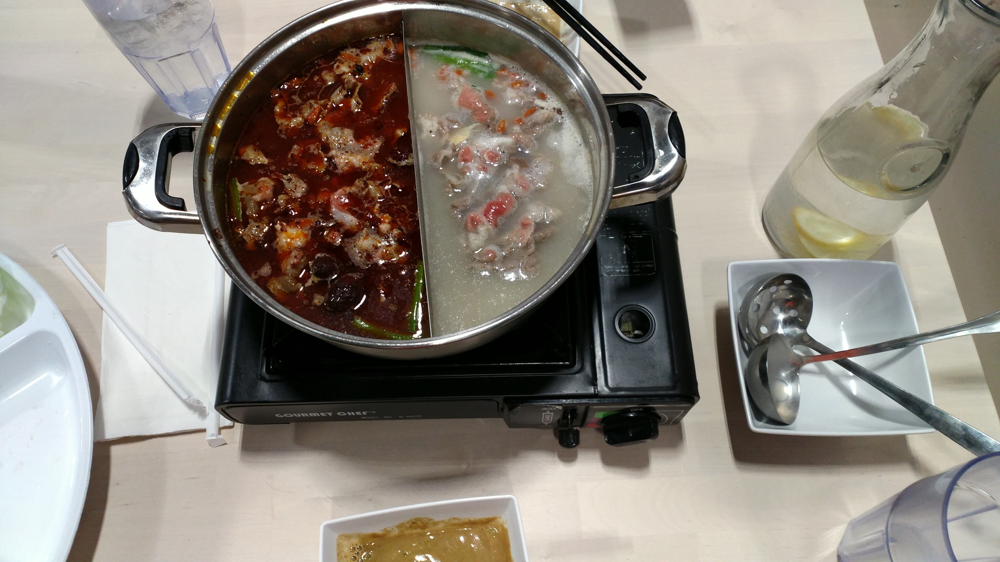

# TAMU住宿吃饭购物学习攻略

对于准备出国半年的同学，住宿可能是一个比较困难的事情，因为租半年房子并不容易，一些office不提供半年的，另一些会贵一些，一种比较好的方案是租一整年的房子，下半年出给西交新来这里的人，由此对应的一种租房方式为租上半年学长（或同学）留下的房子，由于TAMU 学费上涨到19000美元左右，如果理学院能够继续支持的话，来TAMU 的人还是会很多的。

租房子网上要找一个叫office的，或者是找中介，有一个中介叫JJ租房，网址为http://www.jjgrouplease.com/， TAMU 位于college station，这里附近的小区很多是为TAMU租房设置的，有专门的leasing office，很方便，我们并没有直接找office，那时候并不知道有这个选项，当然现在也并不清楚，只是觉着应该ok。TAMU 周围的一个好商店叫HEB，HEB周围的enclave,lexionton等都是比较好的租房子的地方，我们住的地方叫Trails at wolfpen creek. 距离HEB 和学校都很远，但也可以坐校车去购物，方便程度也还算ok，校车很多，白天7-15min一辆，晚上也有1小时一辆，有很多路校车，可以到达college station和bryan的很多地方

吃饭的话，如果自己做是ok的，可以去沃尔玛附近的亚洲超市买一些中国特色的调味品。如果不自己做得话，北门北面有麦当劳，一些墨西哥餐馆和中餐馆，午饭晚饭大约一顿8美元，穷的时候可以去麦当劳一天三顿吃早餐，Sausage buiscuit with hash brown 是一块五，含有700卡路里热量，吃两个就有1400卡路里，像我这样的都能吃饱。麦当劳的一些其他的也很便宜，学校里也有一些食堂。记住吃饭要water，是免费的，任何地都会有。

上课的话，大三上出去的话，有量子力学2（也就是格里菲斯下半本），热力学与统计物理，难度都不大，内容hin简单很清晰，物理图像也很清晰，量子力学没学过上半本也ok ，没关系的。另外David Lee的超导体与超流体不考试也几乎没作业，还发衬衫，一定要选上，据说都给A（雾），选12-18个学分学费都一样，可以多选，还有，TAMU选不了CS的课。数据结构，机器学习就别想了（逃）。英语的话，不用担心，只看课本也能拿A甚至考班里第一（亲测），而且像我托福81的英语渣，最后慢慢的也就听懂个大概了，没啥大事。生活也基本上用不到英语，吃饭就是this，that，first，这些，平时说英语不用担心，老外都听得懂。
 
科研的话，research是一门课，但zubairy不管你，你愿意干啥干啥，你啥也不干也是A，他和你唯一的交流是开学分配导师，会给你安排几个人，叫你选，也可以选其他的，记住，不要选彭涛（如果他还在的话），很水很菜（逃），选有正式教职的，TAMU 正式教职很难拿，很多老师是斯坦福毕业的，水平比postdoc不知道高到哪里去了，选老外，不要害怕，去就ok，也可以选别的，去TAMU之后你会在IQSE（也就是scully组）有一间办公室，几乎每天都会和scully 见一面，中午常有聚餐，TAMU 方向是激光，是很强的，据说Scully常常打电话怒斥期刊编辑（雾），zubairy 会让你做实验，也可以做理论，这都ok，推荐信不用管，最后scully 会给你开一个欢送会，欢送会上会说你以后要推荐信的时候就联系我就行，总之是很热情，很nice。

总而言之吧，搞物理来TAMU是个好地方，科研，推荐信这些都是钦定的，课也很简单，拿A没问题的，大牛都很热情，参与感也很强，很好。要转CS 就别来了，据说伯克利可以选机器学习课，但tamu选不了。
附照片

我们租的房子

上课

老干妈

上台讲题

图书馆

游泳池

朝霞

水塔

松鼠

寿司

寿司碗

自助火锅

万圣节

IQSE午餐

夕阳西下

感恩节IQSE聚餐

沉迷吸猫

盛世美颜

欢送青千回国

美国餐馆

enclave小区

考试卷子

IQSE group

米切尔物理楼

德州下雪

中秋佳节

